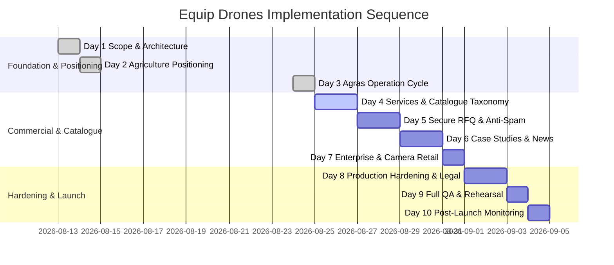

# Equip Drones — Master Site Plan

**Role:** This is the living handoff document for the Equip Drones website. Read it before changing the site, then update the relevant sections and the change log in the same piece of work. It records the *implemented* site, current operating status, and synchronized future plans from [`IMPLEMENTATION_PLAN.md`](IMPLEMENTATION_PLAN.md).

**Last reviewed:** 2026-09-20
**Current release:** static v0 with modular components (no build step or package manager)  
**Languages:** French by default; complete French/English editorial and interface copy
**Authoritative source of current state:** the files described below. Use [`IMPLEMENTATION_PLAN.md`](IMPLEMENTATION_PLAN.md) for the 10-day implementation roadmap and release criteria.

---

## 1. Product and operating model

SARL Equip Drones is DJI's official distributor in Algeria, positioning DJI Agriculture as its core commercial and service pillar. The website is a catalogue and quote-request platform for agricultural, enterprise, and camera equipment. It deliberately displays **no prices**.

### Commercial segments and service boundaries

1. **DJI Agriculture (Core focus — Full sales and support):**
   - Complete lifecycle support: sale & sizing, agronomic consulting, pilot training, accessories, original spare parts, preventative maintenance, and after-sales service (SAV).
   - Dedicated operating cycle experience for heavy spraying/spreading (Agras series).
2. **DJI Enterprise (Sales only):**
   - Industrial inspection, surveying, mapping, public safety, and cargo drones (Matrice, FlyCart series) + Zenmuse payloads.
   - Explicitly marked "sales only"; no implied training, maintenance, or field mission support.
3. **DJI Camera (Sales only):**
   - Consumer, creative, and professional aerial photography drones (Mavic, Air, Mini, Neo, Avata).
   - Retail sales only; accessories and spare-part categories without agricultural-level SAV promises.

### Request for Quotation (RFQ) path

```text
Browse catalogue / sector / product / compare
  → Add items (aircraft, payloads, accessories, parts) to RFQ cart
  → Review multi-item cart in `devis.html`
  → Current v0: WhatsApp / email client / clipboard handoff
  → Target (Day 5 / P0): Secure server-side form submission to info@equipdrones.com 
     with Cloudflare Turnstile CAPTCHA, honeypot, rate limiting, and email authentication (SPF/DKIM/DMARC)
```

---

## 2. Quick-start for the next agent

1. **Local preview:** Serve the project root locally: `python -m http.server 8000`, then open `http://localhost:8000`. Opening `*.html` directly via `file://` also works for basic inspection.
2. **Architecture constraint:** Do not introduce a Node.js build step or framework unless explicitly instructed. Keep the vanilla static architecture.
3. **Data inputs (`assets/data_input/`):**
   - [`assets/data_input/AGRAS_SPECS.csv`](assets/data_input/AGRAS_SPECS.csv): Authoritative Agras aircraft specifications and operational limits.
   - [`assets/data_input/ENTERPRISE_EQUIPEMENT_SPECS.csv`](assets/data_input/ENTERPRISE_EQUIPEMENT_SPECS.csv): Authoritative Enterprise aircraft equipment specifications (RTK, GNSS, FPV, thermal, LiDAR, rangefinder, spotlights, speakers, cameras).
   - [`assets/data_input/ICONS_mapping.csv`](assets/data_input/ICONS_mapping.csv): Mapping between specification fields and reusable SVG icons in `assets/img/svg_icons/`.
4. **Catalogue source of truth:** Maintain `assets/js/data.js` as the runtime source of truth. Every item must have a unique `id`.
5. **Script load order:** Preserve the required script order on every page:  
   `theme-config.js` → `data.js` → `i18n.js` → `app.js` → page-specific/inline script → `motion.js`.
6. **Bilingual text:** All editorial and interface text must have deliberate FR/EN entries in `assets/js/i18n.js`. Use `data-i18n`, `data-i18n-html` for trusted repository-owned markup, and `data-i18n-attr` for attributes. Product prose, spec labels and language-dependent values use `{fr, en}` in `data.js`. Brand names, official organisation names, units and user-entered text remain unchanged. Run `node --test tests/i18n.test.cjs`.
7. **Document updates:** After any structural or feature change, update `MASTER_PLAN.md` and check alignment with `IMPLEMENTATION_PLAN.md`.

---

## 3. Technical architecture

| Area | Current implementation | Primary files |
|---|---|---|
| **Stack** | Static HTML5, CSS custom properties, vanilla ES6 browser JavaScript | All root `*.html`, `assets/` |
| **Visual theme** | Centralized design system with CSS custom properties (`--color-*`, `--spacing-*`, etc.) managed via JavaScript | `assets/js/theme-config.js`, `assets/css/site.css` |
| **Data inputs** | CSV files for specifications and icon mappings (easy to edit & parse) | `assets/data_input/AGRAS_SPECS.csv`, `assets/data_input/ICONS_mapping.csv` |
| **Catalogue runtime** | Structured JavaScript data: products, contacts, ambient photos, spec tables | `assets/js/data.js` |
| **Shared runtime** | Header, footer, language toggle, cart engine, image fallback, reusable product cards, utilities | `assets/js/app.js` (`window.ED`) |
| **Translation** | Client-side FR/EN dictionary with fallback to French | `assets/js/i18n.js` |
| **Motion & UX** | Scroll reveal, counter animations, reading progress, header states, desktop hero parallax | `assets/js/motion.js` |
| **Media assets** | Local SVG logo, product PNGs, ambient photos, SVG spec icons, and infographics | `assets/img/` |

### Shared browser contract (`window.ED`)

`app.js` exposes the `window.ED` namespace:

```text
ED.data       products, lookup/filter helpers, aircraft(), payloads(), bySector()
ED.cart       items, count, add, setQty, remove, clear, change listeners (localStorage 'ed_cart')
ED.i18n       t, L (bilingual resolver), lang, setLang, apply
ED.ui         header, footer, productCard, badge, img, toast, esc, qs, el
ED.contact    company, contact, and social metadata
ED.wilayas    58 Algerian wilayas for quote forms
```

Runtime events:
- `ed:ready`: Shared chrome and initial translations mounted.
- `ed:langchange`: Fired on language toggle; persists `ed_lang` (`fr` or `en`).
- `ed:cartchange`: Fired after cart modifications (`ed_cart` in `localStorage`).

---

## 4. Site map and page inventory

```text
Home (index.html)
├─ DJI Agriculture (agriculture.html)
│  ├─ Operating cycle: heavy spraying / spreading (cycle-operationnel-agras.html)
│  ├─ Agriculture services (services.html)
│  ├─ Sector applications (applications.html)
│  ├─ Model comparator (comparateur.html)
│  └─ Case studies (etudes-de-cas.html — Planned Day 6)
├─ DJI Enterprise — sales only (enterprise.html)
├─ DJI Camera — sales only (camera.html)
├─ Shared Catalogue (catalogue.html) & Product Detail (produit.html?id=…)
├─ Road shows & news (actualites.html — Planned Day 6)
├─ About Equip Drones (a-propos.html)
├─ RFQ Cart & Form (devis.html)
└─ Legal & Privacy (mentions-legales.html, confidentialite.html — Planned Day 8)
```

### Page status table

| Route / file | Status | Purpose & implementation details |
|---|---|---|
| `index.html` | Implemented | Agriculture-led home: hero, proof points, accreditation, featured Agras/Enterprise models, services teaser, cycle link, CTA. |
| `agriculture.html` | Implemented | Agriculture hub linking to Agras models, operating cycle, training, maintenance, applications, and RFQ. |
| `cycle-operationnel-agras.html` | Implemented | Dedicated 6-stage Agras spraying/spreading operating cycle with battery rotation loop and technical advantages. |
| `catalogue.html` | Implemented | Full product catalogue with category, sector, and availability filters (`assets/js/catalogue.js`). |
| `produit.html?id=…` | Implemented | Reusable product detail template (`assets/js/produit.js`): hero, specs, SVG spec icons, DJI link, compatible payloads, RFQ control. |
| `comparateur.html` | Implemented | Multi-model spec comparator (`assets/js/comparateur.js`): side-by-side aircraft comparisons with identical-spec toggling. |
| `services.html` | Implemented | 7-part agriculture service package: sales/sizing, consulting, training, accessories, original spare parts, maintenance/SAV, support. |
| `enterprise.html` | Implemented | DJI Enterprise retail catalogue (Matrice, FlyCart, Zenmuse); clearly labelled "sales only". |
| `camera.html` | Implemented | DJI Camera retail catalogue (Mavic, Air, Mini, Neo, Avata); clearly labelled "sales only". |
| `applications.html` | Implemented | 8 editorial sectors (cereals, palms, vines, market gardening, inspection, surveying, safety, mapping) with recommended drones. |
| `a-propos.html` | Implemented | Company story, official DJI partnership, accreditation, global stats, contact info, and contact form. |
| `devis.html` | Implemented (v0) | Multi-item quote cart with contact form, 58 wilayas, and formatted WhatsApp/email handoff. *(Server-side RFQ planned Day 5)*. |
| `etudes-de-cas.html` | Planned (Day 6) | Agriculture case studies: real field interventions, crop/problem, equipment used, and verified outcomes. |
| `actualites.html` | Planned (Day 6) | Road shows & news listing with dates, Algerian cities, event status, and registration links. |
| `mentions-legales.html` | Planned (Day 8) | Business identifiers, legal status, hosting details, copyright, and disclaimers. |
| `confidentialite.html` | Planned (Day 8) | Privacy policy, RFQ lead data handling, retention limits, and cookie/analytics terms. |

---

## 5. Catalogue inventory and data rules

### Data structure (`assets/js/data.js`)

Each product entry adheres to this schema:

```js
{
  id: "t70p",
  name: "DJI Agras T70P",
  marketSegment: "agriculture", // 'agriculture' | 'enterprise' | 'camera'
  productGroup: "aircraft",     // 'aircraft' | 'payload' | 'accessory' | 'spare_part'
  serviceLevel: "full_support", // 'full_support' (Agri) | 'sales_only' (Enterprise/Camera)
  quoteEligible: true,
  availability: "coming_soon",  // 'in_stock' | 'on_order' | 'coming_soon'
  tagline: { fr: "...", en: "..." },
  usage: { fr: "...", en: "..." },
  useCases: ["cereals", "vines", "palms"],
  specs: [
    { group: { fr: "Performances", en: "Performance" }, rows: [{ label: { fr: "...", en: "..." }, value: "..." }] }
  ],
  compatiblePayloads: [],
  image: "assets/img/products/t70p.png",
  imageFallback: "assets/img/svg/agras-t.svg",
  djiUrl: "https://ag.dji.com/..."
}
```

### Aircraft inventory

| ID | Model | Segment | Service Level | Current Availability | Spec Source |
|---|---|---|---|---|---|
| `t100` | DJI Agras T100 | Agriculture | Full Support | Coming soon / Not Available | `AGRAS_SPECS.csv` |
| `t70p` | DJI Agras T70P | Agriculture | Full Support | Coming soon | `AGRAS_SPECS.csv` |
| `t55` | DJI Agras T55 | Agriculture | Full Support | Coming soon | `AGRAS_SPECS.csv` |
| `t50` | DJI Agras T50 | Agriculture | Full Support | Coming soon | `AGRAS_SPECS.csv` |
| `t25p` | DJI Agras T25P | Agriculture | Full Support | Coming soon | `AGRAS_SPECS.csv` |
| `t25` | DJI Agras T25 | Agriculture | Full Support | In stock (demo) | DJI Official |
| `mavic-3m` | DJI Mavic 3 Multispectral | Agriculture | Full Support | In stock (demo) | `ENTERPRISE_EQUIPEMENT_SPECS.csv` & DJI Official |
| `matrice-400` | DJI Matrice 400 | Enterprise | Sales only | On order | `ENTERPRISE_EQUIPEMENT_SPECS.csv` & DJI Official |
| `matrice-4e` | DJI Matrice 4E | Enterprise | Sales only | In stock (demo) | `ENTERPRISE_EQUIPEMENT_SPECS.csv` & DJI Official |
| `matrice-4t` | DJI Matrice 4T | Enterprise | Sales only | In stock (demo) | `ENTERPRISE_EQUIPEMENT_SPECS.csv` & DJI Official |
| `matrice-4d` | DJI Matrice 4D | Enterprise | Sales only | Coming soon | `ENTERPRISE_EQUIPEMENT_SPECS.csv` & DJI Official |
| `matrice-4td` | DJI Matrice 4TD | Enterprise | Sales only | Coming soon | `ENTERPRISE_EQUIPEMENT_SPECS.csv` & DJI Official |
| `matrice-30t` | DJI Matrice 30T | Enterprise | Sales only | Coming soon | `ENTERPRISE_EQUIPEMENT_SPECS.csv` & DJI Official |
| `matrice-350-rtk` | DJI Matrice 350 RTK | Enterprise | Sales only | In stock (demo) | DJI Official |

### Payloads and accessories

| ID | Name | Segment | Compatibility |
|---|---|---|---|
| `zenmuse-h30t` | DJI Zenmuse H30T | Enterprise | Matrice 400, Matrice 350 RTK |
| `zenmuse-h20n` | DJI Zenmuse H20N | Enterprise | Matrice 350 RTK |
| `zenmuse-l2` | DJI Zenmuse L2 | Enterprise | Matrice 400, Matrice 350 RTK |
| `zenmuse-p1` | DJI Zenmuse P1 | Enterprise | Matrice 400, Matrice 350 RTK |
| `d-rtk-3` | Station Mobile D-RTK 3 | Shared | Matrice 400, 350 RTK, Matrice 4E/4T/4D/4TD, Mavic 3M |

### Spec icons mapping & equipment specification standard

Icons in `assets/img/svg_icons/` are rendered dynamically in cards and spec tables via `ED.ui.getSpecIcon(label)` with a default fallback to `payload.svg`:
- **Payload / Takeoff weight:** `payload.svg` (also serves as generic spec placeholder)
- **Max Takeoff Weight (MTOW):** `max_takeoff_weight.svg`
- **Autonomy / Battery / Flight Time:** `full_battery.svg`
- **Spray Width:** `spray_width_1.svg`
- **Spray Rate / Nozzles:** `spray_nozzle.svg`
- **Flight Radius / Radars (AESA):** `radar.svg`
- **Flight Speed / Max Speed:** `speed.svg`
- **Wind Resistance:** `wind_resistance.svg`
- **Max Flight Altitude:** `max_flight_altitude.svg`
- **Max Takeoff Altitude:** `max_takeoff_altitude.svg`
- **RTK / D-RTK Antennas:** `rtk_antenna.svg`
- **GNSS Antennas / Satellite / Positioning:** `sattelite.svg`
- **FPV Cameras:** `fpv_camera.svg`
- **Thermal Cameras:** `thermal_camera.svg`
- **Laser Rangefinder:** `laser_rangefinder.svg`
- **Spotlights & Infrared Lights:** `spotlight.svg`
- **Loudspeakers / Speakers:** `loudspeaker.svg`
- **Wide Cameras:** `wide_camera.svg`
- **Telephoto / Zoom Cameras:** `telephoto_camera.svg`
- **Obstacle Avoidance / IP Protection:** `shield.svg`
- **Generic Optical / Built-in Camera / Gimbal:** `simple_camera.svg`
- **Remote Control & Radiocommande:** `radio_tower.svg`

#### Standardized Agras specification structure (`assets/js/data.js`)
All DJI Agras models (`t100`, `t70p`, `t55`, `t50`, `t25p`, `t25`) feature a streamlined 3-tier spec structure:
1. **Spécifications Clés / Key Specifications:** Preserved core metrics (Payload, MTOW, Autonomy, Spray Width, Max Flight Speed).
2. **Performances de vol / Flight Performance:** Uniform across all models (Max flight altitude: 100 m; Flight Radius: 2000 m; Wind Resistance: 6 m/s; Max Takeoff Altitude: 4500 m Above Sea Level).
3. **Équipements intégrés / Integrated Equipment:** Uniform integrated systems (RTK Antenna, GNSS Antenna, AESA Radars, Obstacle Avoidance, FPV Camera) with dedicated exceptions:
   - **T100:** Includes `LiDAR` in addition.
   - **T25P:** Includes `Projecteur` / `Spotlight` in addition.

#### Standardized Enterprise equipment specifications (`ENTERPRISE_EQUIPEMENT_SPECS.csv`)
All Enterprise models (`matrice-400`, `matrice-4e`, `matrice-4t`, `matrice-4d`, `matrice-4td`, `matrice-30t`, `matrice-350-rtk`) feature standardized equipment entries:
- **Navigation & Positioning:** Antenne RTK (`rtk_antenna.svg`), Station D-RTK 3, Antenne GNSS (`sattelite.svg`).
- **Vision & Safety:** Évitement d’obstacles (`shield.svg`), Radars AESA/CSM (`radar.svg`), Télémètre laser (`laser_rangefinder.svg`).
- **Imaging Payloads & Sensors:** Caméra FPV (`fpv_camera.svg`), Caméra grand-angle (`wide_camera.svg`), Téléobjectif moyen & Téléobjectif (`telephoto_camera.svg`), Caméra zoom, Caméra thermique radiométrique (`thermal_camera.svg`), LiDAR (`lidar.svg`), Accessoires de nacelle Zenmuse (`simple_camera.svg`).
- **Operational Accessories:** Projecteur d’appoint AL1 / infrarouge (`spotlight.svg`), Haut-parleur d’appoint AS1 (`loudspeaker.svg`).

---

## 6. Content, assets, and design system

- **Design system (`assets/js/theme-config.js`):** Centralized theme tokens for colors (`primary`, `accent`, `bg`, `surface`, `border`, `text`, `icon`), fonts, spacing, shadows, and transitions. Propagated to CSS variables via JavaScript.
- **Product imagery:** Stored locally in `assets/img/products/*.png` with vector fallbacks in `assets/img/svg/*.svg`.
- **Infographics:** High-resolution operating diagrams in `assets/img/infographics/` (e.g. `agras_cycle.png`).
- **Translation:** French is the default. All 12 pages, dynamic catalogue views, form errors, prepared messages, metadata and accessible labels support French and English. The selected language persists across navigation; switching preserves form and selection state.

---

## 7. Quality and accessibility standards

- **Semantic HTML & ARIA:** Valid semantic elements (`main`, `nav`, `section`, `article`), visible keyboard focus, live cart badges, and descriptive alt text.
- **Responsive design:** Breakpoints at 1200px, 900px, and 640px. Table and card horizontal scrolling contained on mobile screens.
- **Resilience:** Fallbacks for broken images, missing `localStorage`, invalid query IDs, and disabled JavaScript.
- **Performance & Motion:** Respects `prefers-reduced-motion`. Deferred media and iframe embeds (`youtube-nocookie.com`).

---

## 8. Synchronized roadmap and production backlog

Aligned directly with the 10-day implementation sequence from [`IMPLEMENTATION_PLAN.md`](IMPLEMENTATION_PLAN.md):



### P0 — Must launch first (Release blockers)

1. **Authoritative catalogue & stock:** Replace demo availability with confirmed stock policy; trace all specs to DJI publications.
2. **Secure RFQ submission (Day 5):**
   - Server-side email delivery to company sales inbox (`info@equipdrones.com`) with unique reference IDs.
   - Cloudflare Turnstile CAPTCHA (server-verified), honeypot field, completion time checks, and IP rate limiting.
   - Zero secrets or mail credentials exposed to the client.
   - SPF, DKIM, and DMARC configuration for sender domain.
3. **Legal & Privacy compliance (Day 8):** Add `mentions-legales.html` and `confidentialite.html` covering company identifiers, data retention, RFQ processing, and cookie policy.
4. **Security headers & HTTPS:** Enforce HTTPS, strict CSP (with YouTube nocookie allow-list), `Strict-Transport-Security`, `X-Content-Type-Options: nosniff`, and anti-clickjacking headers.
5. **Mobile & Accessibility QA:** Verify complete responsive workflows from 360px to 1440px across Chromium, Firefox, and Safari.

### P1 — Launch when approved content is ready

1. **Enterprise & Camera retail-only refinement (Day 7):** Ensure clear "sales only" badges and banners across all non-agriculture cards and RFQ flows.
2. **Case studies (`etudes-de-cas.html`) & Road shows (`actualites.html`) (Day 6):** Data-driven static sections for Algerian field results and upcoming events.
3. **English editorial coverage — implemented locally 2026-09-20:** Full FR/EN coverage and switcher fixes completed; deployment remains a separate step.
4. **SEO & Structured Data:** XML sitemap, `robots.txt`, canonical URLs, social open graph tags, and schema.org structured data (Organization, Product, Service, Event).

### P2 — Post-launch improvements

1. **CRM / Lead management sync:** Automated webhook sync from RFQ endpoint to sales pipeline.
2. **Downloadable documentation:** Official DJI datasheets and operational checklists per product.
3. **Advanced privacy-compliant analytics:** Matomo or lightweight analytics with explicit user consent.

---

## 9. Change-management checklist

When making changes to the site:

| Item Changed | Required Updates & Verifications |
|---|---|
| **Agras / Drone Specs** | Edit `assets/data_input/AGRAS_SPECS.csv` → update `assets/js/data.js` → verify product card, detail page, and comparator. |
| **Spec Icons** | Check `assets/data_input/ICONS_mapping.csv` → place SVG in `assets/img/svg_icons/` → verify rendering in `app.js` and `produit.js`. |
| **Product / Payload** | Update `data.js` (unique ID, segment, service level, specs, compatibility) → check catalogue filters, comparator, and RFQ cart. |
| **Visuals & Theme** | Modify `assets/js/theme-config.js` THEME object → test CSS variables in `site.css` across all pages. |
| **Contact / Social** | Update `ED_CONTACT` in `data.js` → verify header, footer, `a-propos.html`, and `devis.html`. |
| **RFQ & Form Logic** | Verify validation in `devis.js` → test submission flow, feedback states, and cart preservation. |
| **Documentation** | Update `MASTER_PLAN.md` change log and review consistency with `IMPLEMENTATION_PLAN.md`. |

---

## 10. Bilingual copy verification — 2026-09-20

**Customer success:** Buyers can understand the equipment, service scope and RFQ handoff in either language without losing their work.

**Customer signal:** FR/EN round-trips preserve entered information, quantities, filters, comparison selections and prepared requests; all tested text and attributes follow the language choice.

**Business objective:** Reduce language-related RFQ abandonment and clarification work for sales.

**Linking assumption:** Clear, consistent product information and an uninterrupted enquiry flow help qualified buyers complete a useful request. No conversion uplift has been measured.

**Ledger:** No owning issue or issue-tracker workflow was identified for this standalone repository. This document records the implementation and validation; no Linear update was made.

### What changed

- Added deliberate French/English copy across all 12 root pages, including page titles, descriptions, alt text, accessible names, filters, empty states and explanatory prose.
- Localized language-dependent specifications and product highlights for the 39 catalogue records. Removed import-only CSV labels from visitor-facing specifications.
- Corrected overstated wording and translation mismatches, clarified agricultural support versus Enterprise/Camera sales, and removed unconditional safety, productivity and charging promises. Discontinued T25/T50 copy now matches their existing catalogue status.
- Corrected V1 wording from “129 dB at 700 m” to “129 dB at 1 m; maximum range 700 m” for Matrice 400, using [DJI’s V1 specifications](https://enterprise.dji.com/zenmuse-v1/specs).
- Prepared quote and contact messages, email subjects, validation errors and clipboard guidance use the selected language; free text is preserved. The RFQ button says “Prepare my request” because transmission still occurs in the visitor’s messaging application.
- Replaced the Agras diagram containing embedded English with a bilingual HTML sequence. No image-generation dependency was added.
- Preserved header focus/mobile menu state, product quantity, form activity selection, cart and comparison state on language changes. Fixed the Agriculture language-function check and stale animated-counter callbacks.
- Kept both language controls visible at 360px. Fixed the existing theme initialization exception and aligned its defaults with the existing CSS tokens to retain the established design.

### Verification

- `node --test tests/i18n.test.cjs`: 7 passing tests, covering dictionary completeness, translation references, script syntax, all product cards, persistent language selection, generated messages and theme initialization.
- In-app Chromium preview: all 12 pages switched FR → EN → FR; all 39 product detail routes rendered in both languages. Unknown/missing product IDs show a translated not-found state. Three products with no spec rows retain their existing no-spec presentation.
- Checked rendered dictionary text and accessible attributes across all pages. Product document titles intentionally use the product name or translated not-found title instead of the generic template title.
- RFQ: required errors translate immediately; entered fields/activity survive switching; prepared WhatsApp/email bodies and subjects translate; free text remains intact. No message was sent.
- Product quantity of 3 survives switching, adds correctly, and persists in the cart after navigation/reload. Contact-form errors translate immediately.
- Mobile menu remains open on switching and focus remains on the selected language button. At 360px both language controls are visible; 768px filters and 1440px comparison preserve their selections. Comparison deep links and hide-identical state survive switching.
- `git diff --check` passes. Local browser console checked after fixing the pre-existing theme exception.

### Limits and follow-up

This is a language/copy consistency review, not independent verification of every supplier specification, company accreditation, inventory status or historical industry statistic. Those remain business-supplied information requiring owner/source confirmation before publication. Existing “coming soon” and “discontinued” statuses and RFQ handoff architecture remain in place. Firefox/Safari and deployed-site testing were not performed; changes are local and have not been pushed or deployed.

---

## 11. Automatic bilingual maintenance

The repository skill [.agents/skills/ed-website-bilingual-copy/SKILL.md](.agents/skills/ed-website-bilingual-copy/SKILL.md) maintains both languages whenever a coding agent changes public website copy. `AGENTS.md` and `.github/copilot-instructions.md` route agents to it without a separate translation request. It covers new and changed copy, including existing pairs whose counterpart may now be stale, and skips changes without public copy.

The intended customer outcome is consistent information and uninterrupted RFQ preparation in either language. The customer signal is matching FR/EN meaning and a language round-trip that preserves visitor state. This should reduce language-related RFQ abandonment and sales clarification, though no conversion uplift has been measured.

The skill is versioned with the repository. Its implicit invocation policy is enabled, and a local Codex skill link points to this checkout's skill folder. Other clones can use the repository instructions without that local link.

The workflow `.github/workflows/bilingual-copy.yml` runs `node --test tests/i18n.test.cjs` on pushes and pull requests, with manual dispatch also available. It catches missing declared translations and broken references; it does not judge semantic accuracy, detect every hard-coded sentence, translate human edits, or generate commits. Agents perform that copy review using the skill. No external translation service or API key is required.

Validation: the skill frontmatter and metadata were validated; the seven regression tests passed; controlled missing-translation and unknown-key cases were verified to fail in a temporary checkout. GitHub execution starts only after the workflow is pushed. No branch protection, push or deployment was performed. This remains a standalone repository with no identified owning issue; no Linear update was made.

---

## 12. Change log

| Date | Change | Notes |
|---|---|---|
| 2026-09-21 | Renamed Vision System spec to Obstacle Avoidance across all categories | Renamed all instances of "Vision System" (`Système de vision` / `Système de vision pour l’évitement d’obstacles`) to "Obstacle Avoidance" (`Évitement d’obstacles`) across all categories (Agriculture, Enterprise, Camera) in `assets/js/data.js` and CSV inputs (`ENTERPRISE_EQUIPEMENT_SPECS.csv`, `CAMERA_EQUIPEMENT_SPECS.csv`, `Mavic3M_SPECS.csv`, `ICONS_mapping.csv`). Mapped icon resolution to `shield.svg`. Full bilingual verification passed. |
| 2026-09-21 | Removed DJI Dock 3 from catalogue | Removed `dock-3` from `assets/js/data.js`, `applications.html`, and `MASTER_PLAN.md`. Updated `matrice-4td` and `matrice-4d` descriptions to generic automated operations. Full bilingual verification passed. |
| 2026-09-21 | Aligned Zenmuse specs, highlights, and similar accessories | Streamlined Zenmuse payload specs in `assets/js/data.js` to only include specs mentioned in `assets/data_input/zenmuse_specs.csv`. Updated highlights to prioritize thermal cameras, main cameras, and laser rangefinders. Updated `relatedBlock` in `assets/js/produit.js` to show similar accessories (payloads) when viewing accessory product detail pages, rather than drones. Full bilingual verification passed. |
| 2026-09-20 | Automatic bilingual copy skill and CI checks | Added a repository skill, implicit invocation metadata, agent/Copilot routing, and a read-only GitHub regression workflow. Translation is performed by the coding agent; CI validates declared translations. |
| 2026-09-20 | Complete FR/EN copy and reliable language switching | Updated all 12 pages, bilingual catalogue values, runtime messages and accessible labels; preserved visitor state; added 7 regression tests. See bilingual verification above. |
| 2026-09-03 | Updated Agriculture highlights bar: Masse Max. Décollage & Largeur Pulvérisation | Updated highlights across all agricultural drones (`t100`, `t70p`, `t55`, `t50`, `t25p`, `t25`) in `assets/js/data.js`: renamed maximum takeoff weight spec description in French to `Masse Max. Décollage` with icon `max_takeoff_weight.svg`, and renamed spray width spec description to `Largeur Pulvérisation` with icon `spray_width_1.svg`. Updated `getSpecIcon` in `assets/js/app.js` and `assets/data_input/ICONS_mapping.csv`. |
| 2026-09-03 | Integrated Enterprise equipment specs & 15+ new SVG icons | Integrated `assets/data_input/ENTERPRISE_EQUIPEMENT_SPECS.csv` into runtime data (`assets/js/data.js`). Replaced placeholder equipment rows across Enterprise models (`matrice-400`, `matrice-4e`, `matrice-4t`, `matrice-4td`, `matrice-30t`, `matrice-350-rtk`) and added `matrice-4d`. Updated `assets/data_input/ICONS_mapping.csv` and upgraded `getSpecIcon` in `assets/js/app.js` with full bilingual support for newly added SVG icons (`rtk_antenna.svg`, `fpv_camera.svg`, `thermal_camera.svg`, `laser_rangefinder.svg`, `spotlight.svg`, `loudspeaker.svg`, `wide_camera.svg`, `telephoto_camera.svg`, `simple_camera.svg`, `max_flight_altitude.svg`, `max_takeoff_altitude.svg`, `max_takeoff_weight.svg`, `wind_resistance.svg`, `lidar.svg`). |
| 2026-08-31 | Updated Agriculture application sectors (Spraying, Spreading, Cleaning, Mapping) | Updated `useCases` across all DJI Agras aircraft (`t55`, `t70p`, `t50`, `t25p`, `t25`) to `['pulverisation', 'epandage', 'nettoyage']` (Spraying, Spreading, Cleaning) and `t100` to include `cartographie` (Mapping via LiDAR). Added bilingual i18n keys for spraying, spreading, cleaning, mapping. Updated `agriculture.html` filter bar chips and `applications.html` fallback renderer. |
| 2026-08-31 | Standardized Agras specifications & streamlined spec tables | Overhauled specifications across all DJI Agras aircraft (`t100`, `t70p`, `t55`, `t50`, `t25p`, `t25`) in `assets/js/data.js`. Preserved key core metrics and replaced long technical tables with two uniform sections: **Flight Performance** (100m altitude, 2000m radius, 6m/s wind, 4500m ASL takeoff) and **Integrated Equipment** (RTK & GNSS Antennas, AESA Radars, Obstacle Avoidance Vision System, FPV Camera) with model exceptions (T100: LiDAR; T25P: Spotlight). Updated `app.js`, `produit.js`, and `comparateur.js` with bilingual resolution and expanded icon mapping with placeholder fallback to `payload.svg`. |
| 2026-08-31 | Converted data input files to CSV & synchronized Master Plan | Converted `assets/data_input/` files from XLSX to CSV format (`AGRAS_SPECS.csv`, `ICONS_mapping.csv`) for clean version control and lightweight parsing. Updated `MASTER_PLAN.md` to reflect the streamlined `IMPLEMENTATION_PLAN.md`: three-segment commercial model (Agriculture full support vs Enterprise/Camera sales-only), 10-day implementation roadmap, planned pages (`etudes-de-cas.html`, `actualites.html`, legal pages), secure RFQ specifications, and updated backlog. |
| 2026-08-24 | Removed Agriculture sensor section & added SVG spec icons | Removed "Capteurs Multispectraux, LiDAR & Stations Sol" section from `agriculture.html` (retained on Enterprise). Integrated SVG spec icons from `assets/img/svg_icons/` mapped to `ICONS_mapping.csv` across product cards, hero stats, spec tables, and comparator. Added `icon` color configuration in `theme-config.js` and `THEME_CONFIGURATION.md`. |
| 2026-08-24 | Integrated Agras specs & built operational cycle page | Updated Agras product models (`t100`, `t70p`, `t55`, `t50`, `t25p`) in `data.js` with key specs from `AGRAS_SPECS.csv`. Added direct link to official DJI specifications. Created `cycle-operationnel-agras.html` featuring `agras_cycle.png` infographic and continuous 4-battery rotation loop, linked from `index.html` and `agriculture.html`. |
| 2026-08-18 | Replaced site logo with new high-quality SVG | Updated `ED_CONTACT.logo` in `data.js` to point to `assets/img/svg/Logo.svg`. All logo references throughout the site (header, footer, about page) now use the new SVG logo. |
| 2026-08-18 | Added centralized theme configuration system | Created `assets/js/theme-config.js` to manage colors, spacing, typography, shadows, and transitions. All pages updated to load theme config before data.js. CSS custom properties (variables) now populated by THEME object for easy customization. |
| 2026-08-13 | Created initial master plan after source audit | Documents v0 structure, data inventory, feature boundaries, and initial production backlog. |
